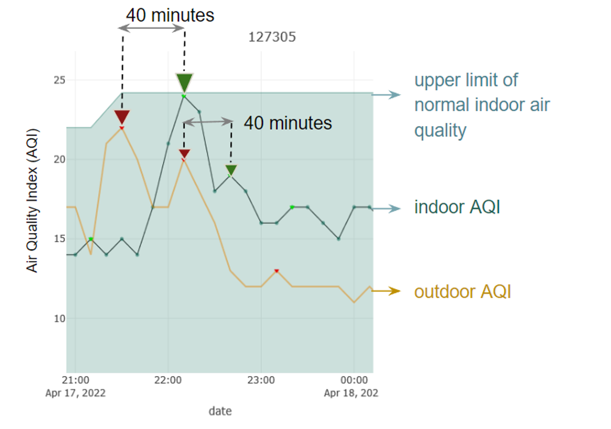

# Pilot-Air-Quality-Analysis-in-the-Bay-Area
Characterize communities’ air quality and explore the human-induced and environment-induced influence on it

## Description

The CEE 218Z Air Quality team partnered with Our Communities, Our Bay (OCOB) to study the quality and impact of local indoor and outdoor air. As a whole, OCOB represents a multi-faceted research project that aims to better understand the climate hazards that Bay Area communities face and, in doing so, empower communities to improve their resilience and well-being. The connectivity and distribution of the sensors were explored first. The locations of newly installed sensors were recommended based on this. The importance of analyzing and improving indoor air quality was demonstrated, as indoor air quality is worse – and thus more dangerous – than outdoor. The relationship between local indoor and outdoor air quality was analyzed. The results show a high relationship between indoor and outdoor air quality and identify a distinct 40-50 minute lag period between spikes in outdoor air pollution and subsequent changes in indoor air pollution levels. The impact of highway proximity and rush hour times on outdoor air quality was clarified. The relationship between a building's characteristics and indoor air quality was qualified. Finally, a concise and comprehensive air quality report for homeowners was created via corporating the community feedback.
